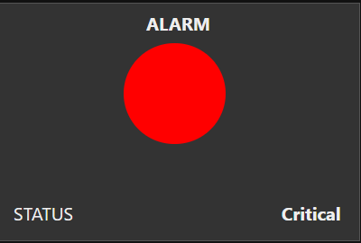

# How-can-we-control-a-device-and-make-an-alarm-with-the-node-red-dashboard.
- Here, I try to show how to generate random data in two ways for two types of temperature. One is by the node which is called a random node and another one is the function      node. We have to write code in JavaScript.
And I make a function that when I select the manual mode that time the active and inactive button will work. But when I select schedule mode that time the button means the active and inactive buttons will not work. 
In the meantime, I use a colour function node when I select manual and change the button, it will also change the colour status. We can easily find out what is going on in the system.


 

## Node-red flow

```
[{"id":"c8c3648a.289848","type":"tab","label":"Chiller Machine Control","disabled":false,"info":""},{"id":"88022408.8282e8","type":"ui_button","z":"c8c3648a.289848","name":"Start Manual Mode","group":"727f3f0d.d762a","order":3,"width":6,"height":1,"passthru":false,"label":"On/Off Manual Mode","tooltip":"","color":"","bgcolor":"{{msg.color}}","icon":"","payload":"","payloadType":"str","topic":"buttonMANUAL","x":610,"y":60,"wires":[[]]},{"id":"fb407299.9aead","type":"ui_gauge","z":"c8c3648a.289848","name":"Inlet water Temperature","group":"79514d88.614534","order":1,"width":3,"height":3,"gtype":"gage","title":"","label":"°C","format":"{{value}}","min":"-5","max":"20","colors":["#b3000c","#e6e600","#099ddc"],"seg1":"5","seg2":"12","x":650,"y":540,"wires":[]},{"id":"83a9a9c4.9ed438","type":"inject","z":"c8c3648a.289848","name":"","repeat":"5","crontab":"","once":false,"onceDelay":0.1,"topic":"","payload":"","payloadType":"date","x":150,"y":200,"wires":[["ffd17b0e.716688"]]},{"id":"ffd17b0e.716688","type":"function","z":"c8c3648a.289848","name":"Random","func":"msg.payload=Math.floor(Math.random() * 10) + 1;\nreturn msg;","outputs":1,"noerr":0,"initialize":"","finalize":"","libs":[],"x":320,"y":200,"wires":[["eb53532e.6c2c7"]]},{"id":"eb53532e.6c2c7","type":"delay","z":"c8c3648a.289848","name":"","pauseType":"delay","timeout":"5","timeoutUnits":"seconds","rate":"1","nbRateUnits":"1","rateUnits":"second","randomFirst":"1","randomLast":"5","randomUnits":"seconds","drop":false,"x":480,"y":200,"wires":[["87cc3d27.1472b"]]},{"id":"87cc3d27.1472b","type":"ui_gauge","z":"c8c3648a.289848","name":"Outlet water Temperature","group":"f65465fa.fdd188","order":1,"width":3,"height":3,"gtype":"gage","title":"","label":"°C","format":"{{value}}","min":"-10","max":"20","colors":["#01f411","#e6e600","#ca3838"],"seg1":"5","seg2":"12","x":610,"y":160,"wires":[]},{"id":"124fe6fe.8f2d49","type":"ui_button","z":"c8c3648a.289848","name":"Shut_down","group":"ac5e4a47.09ecb8","order":3,"width":3,"height":2,"passthru":false,"label":"Shut_down","tooltip":"","color":"","bgcolor":"{{msg.color}}","icon":"","payload":"","payloadType":"str","topic":"","x":130,"y":160,"wires":[[]]},{"id":"4a894bbe.cb2bf4","type":"ui_button","z":"c8c3648a.289848","name":"Reboot_System","group":"ac5e4a47.09ecb8","order":4,"width":3,"height":2,"passthru":false,"label":"Reboot","tooltip":"","color":"","bgcolor":"{{msg.color}}","icon":"","payload":"","payloadType":"str","topic":"","x":140,"y":120,"wires":[[]]},{"id":"2d6fc0ec.2513f","type":"ui_button","z":"c8c3648a.289848","name":"Manual/Schedule","group":"727f3f0d.d762a","order":1,"width":6,"height":1,"passthru":false,"label":"Manual/Schedule","tooltip":"click me","color":"","bgcolor":"{{msg.color}}","icon":"","payload":"true","payloadType":"str","topic":"buttonAUTO","x":150,"y":60,"wires":[["25ffa004.f3df4"]]},{"id":"2b5a709a.4e35f","type":"ui_switch","z":"c8c3648a.289848","name":"","label":"Manual/Schedual","tooltip":"","group":"727f3f0d.d762a","order":2,"width":6,"height":1,"passthru":true,"decouple":"false","topic":"s1","topicType":"str","style":"","onvalue":"true","onvalueType":"bool","onicon":"","oncolor":"","offvalue":"false","offvalueType":"bool","officon":"","offcolor":"","animate":true,"x":310,"y":280,"wires":[["d368c4ac.110f88"]]},{"id":"ca92c16.2c95b4","type":"ui_switch","z":"c8c3648a.289848","name":"","label":"Manual Start/Stop","tooltip":"","group":"727f3f0d.d762a","order":4,"width":6,"height":1,"passthru":true,"decouple":"false","topic":"s2","topicType":"str","style":"","onvalue":"true","onvalueType":"bool","onicon":"","oncolor":"","offvalue":"false","offvalueType":"bool","officon":"","offcolor":"","animate":true,"x":310,"y":400,"wires":[["12b5240c.9d462c"]]},{"id":"25ffa004.f3df4","type":"debug","z":"c8c3648a.289848","name":"","active":true,"tosidebar":true,"console":false,"tostatus":false,"complete":"payload","targetType":"msg","x":330,"y":60,"wires":[]},{"id":"772a266.335f1d8","type":"debug","z":"c8c3648a.289848","name":"","active":true,"tosidebar":true,"console":false,"tostatus":false,"complete":"false","x":730,"y":440,"wires":[]},{"id":"12b5240c.9d462c","type":"function","z":"c8c3648a.289848","name":"output control","func":"var payload = msg.payload;\nvar count1=global.get('count');\n\nif (count1 === \"inactive\"){\n        msg.payload = payload;\n        return msg;\n}\n\nif (count1 === \"active\"){\n        msg.payload = false;\n        return msg;\n    \n}\n\n\n\n\n\n","outputs":1,"noerr":0,"initialize":"","finalize":"","libs":[],"x":500,"y":400,"wires":[["772a266.335f1d8","d34ed19a.e0489"]]},{"id":"88351f3c.5cf24","type":"inject","z":"c8c3648a.289848","name":"","repeat":"","crontab":"","once":false,"onceDelay":0.1,"topic":"","payload":"false","payloadType":"bool","x":130,"y":440,"wires":[["ca92c16.2c95b4"]]},{"id":"cfef35.9e62d0c8","type":"inject","z":"c8c3648a.289848","name":"","repeat":"","crontab":"","once":false,"onceDelay":0.1,"topic":"","payload":"true","payloadType":"bool","x":130,"y":380,"wires":[["ca92c16.2c95b4"]]},{"id":"6abc1fc5.229b4","type":"inject","z":"c8c3648a.289848","name":"","repeat":"","crontab":"","once":false,"onceDelay":0.1,"topic":"","payload":"false","payloadType":"bool","x":130,"y":320,"wires":[["2b5a709a.4e35f"]]},{"id":"7c5b002c.d530f","type":"inject","z":"c8c3648a.289848","name":"","repeat":"","crontab":"","once":false,"onceDelay":0.1,"topic":"","payload":"true","payloadType":"bool","x":130,"y":260,"wires":[["2b5a709a.4e35f"]]},{"id":"fac1bbd8.529cf8","type":"debug","z":"c8c3648a.289848","name":"","active":true,"tosidebar":true,"console":false,"tostatus":false,"complete":"false","x":710,"y":280,"wires":[]},{"id":"d368c4ac.110f88","type":"function","z":"c8c3648a.289848","name":"active/inactive","func":"var payload = msg.payload;\nvar count=global.get('count') || 0;\n\nif(payload === true){\n    count = \"active\";\n}\nelse {\n    count = \"inactive\";\n}\n\n\nmsg.payload=count;\n\n\nglobal.set('count',count);\n\n\nreturn msg;","outputs":1,"noerr":0,"initialize":"","finalize":"","libs":[],"x":520,"y":280,"wires":[["fac1bbd8.529cf8"]]},{"id":"6a334487.ca2adc","type":"debug","z":"c8c3648a.289848","name":"","active":true,"tosidebar":true,"console":false,"tostatus":false,"complete":"payload","targetType":"msg","x":370,"y":520,"wires":[]},{"id":"56c581df.e5f5","type":"inject","z":"c8c3648a.289848","name":"","repeat":"","crontab":"","once":false,"onceDelay":0.1,"topic":"","payload":"count","payloadType":"flow","x":140,"y":520,"wires":[["6a334487.ca2adc"]]},{"id":"48d294e8.ffcd1c","type":"ui_template","z":"c8c3648a.289848","group":"4304d832.dab068","name":"Switch 1 Status","order":1,"width":0,"height":0,"format":"<style>\n.led-green {\nmargin: 0 auto;\nwidth: 84px;\nheight: 84px;\nbackground-color: #ABFF00;\nborder-radius: 50%;\n{\n</style>\n<table>\n    <tr>\n  <h4> &nbsp &nbsp &nbsp &nbsp &nbsp &nbsp &nbsp &nbsp &nbsp &nbsp &nbsp &nbsp &nbsp &nbsp  STATUS </h4>\n</tr>\n<tr>\n<td><div class=\"led-green\" style=\"background-color:{{msg.payload}}\"></div></td>\n<td></td>\n</tr>\n</table>","storeOutMessages":true,"fwdInMessages":true,"resendOnRefresh":false,"templateScope":"local","x":860,"y":400,"wires":[[]]},{"id":"d34ed19a.e0489","type":"function","z":"c8c3648a.289848","name":"Couleur","func":"\nif (msg.topic==\"manualschedual\") //not real value\n{\n    var newmsg={};\n    newmsg.payload= \"black\" ;\n\treturn newmsg;\n\n}\n\nif(msg.payload == '1' || msg.payload==1 || msg.payload)\n{\n\tvar newmsg = {\n    payload: \"lime\" \n\t};\n\treturn newmsg;\n}\nelse if(msg.payload =='0' || msg.payload==0 || !msg.payload)\n{\n\tvar newmsg = {\n    payload: \"red\" \n\t};\n\treturn newmsg;\n}","outputs":1,"noerr":0,"initialize":"","finalize":"","libs":[],"x":700,"y":400,"wires":[["48d294e8.ffcd1c"]]},{"id":"8ecae21.bd5172","type":"debug","z":"c8c3648a.289848","name":"","active":true,"tosidebar":true,"console":false,"tostatus":false,"complete":"false","x":580,"y":600,"wires":[]},{"id":"f0f05758.c73218","type":"inject","z":"c8c3648a.289848","name":"","props":[{"p":"payload"},{"p":"topic","vt":"str"}],"repeat":"","crontab":"","once":false,"onceDelay":0.1,"topic":"","payload":"","payloadType":"date","x":130,"y":620,"wires":[["9e16712b.a267d"]]},{"id":"9e16712b.a267d","type":"random","z":"c8c3648a.289848","name":"","low":1,"high":10,"inte":"true","property":"payload","x":310,"y":620,"wires":[["fb407299.9aead","8ecae21.bd5172"]]},{"id":"727f3f0d.d762a","type":"ui_group","name":"Control System","tab":"8fc089eb.0efde8","order":4,"disp":true,"width":6,"collapse":true},{"id":"79514d88.614534","type":"ui_group","name":"Inlet","tab":"8fc089eb.0efde8","order":2,"disp":true,"width":3,"collapse":true},{"id":"f65465fa.fdd188","type":"ui_group","name":"Outlet","tab":"8fc089eb.0efde8","order":3,"disp":true,"width":3,"collapse":true},{"id":"ac5e4a47.09ecb8","type":"ui_group","name":"Control_Panel of IoT2040","tab":"","order":5,"disp":true,"width":"6","collapse":true},{"id":"4304d832.dab068","type":"ui_group","name":"Device Status","tab":"8fc089eb.0efde8","order":1,"disp":false,"width":"6","collapse":false},{"id":"8fc089eb.0efde8","type":"ui_tab","name":"ETI","icon":"dashboard","order":1,"disabled":false,"hidden":false}]

```
- I also created an alarm dashboard where I tried to show the real status of the devices.




- Here is the alarm of node-red flow.

 

## Node-red flow

```
[{"id":"abe5fdac.b8167","type":"tab","label":"Alarm ","disabled":false,"info":""},{"id":"2ffd9283.af754e","type":"inject","z":"abe5fdac.b8167","name":"","props":[{"p":"payload"},{"p":"topic","vt":"str"}],"repeat":"60","crontab":"","once":false,"onceDelay":0.1,"topic":"","payload":"","payloadType":"date","x":110,"y":160,"wires":[["dcc4defa.aafc5","46ac793d.f0a798"]]},{"id":"dcc4defa.aafc5","type":"function","z":"abe5fdac.b8167","name":"generator","func":"var max = 99;\nvar min = 30;\nmsg.payload= Math.round(Math.random() * (max - min +1) + min);\nreturn msg;","outputs":1,"noerr":0,"initialize":"","finalize":"","libs":[],"x":260,"y":160,"wires":[["55e4dd38.4d9424","9602899.275d178","2fdf3d44.c3c7f2"]]},{"id":"2fdf3d44.c3c7f2","type":"debug","z":"abe5fdac.b8167","name":"","active":true,"tosidebar":true,"console":false,"tostatus":false,"complete":"false","statusVal":"","statusType":"auto","x":730,"y":60,"wires":[]},{"id":"9602899.275d178","type":"function","z":"abe5fdac.b8167","name":"","func":"var num = msg.payload;\n\nif (50 <= num && num < 70) {\n    count = 0\n} else if (num > 71) {\n    count = 1\n}else {\n    count = 2\n}\n\n\nmsg.payload = count; \n\nreturn msg;\n","outputs":1,"noerr":0,"initialize":"","finalize":"","libs":[],"x":420,"y":120,"wires":[["2fdf3d44.c3c7f2","8f06d066.d3c14"]]},{"id":"d6e48058.85dd2","type":"ui_template","z":"abe5fdac.b8167","group":"dc93f64e.e19118","name":"Switch 1 Status","order":1,"width":0,"height":0,"format":"<style>\n.led-green {\nmargin: 0 auto;\nwidth: 90px;\nheight: 90px;\nbackground-color: #ABFF00;\nborder-radius: 50%;\n{\n</style>\n<table>\n    <tr>\n <h4>&nbsp; &nbsp; &nbsp; &nbsp; &nbsp; &nbsp; &nbsp; &nbsp; &nbsp; &nbsp; &nbsp; &nbsp; &nbsp; &nbsp; ALARM </h4>\n    </tr>\n<tr>\n<td><div class=\"led-green\" style=\"background-color:{{msg.payload}}\"></div></td>\n<td></td>\n</tr>\n</table>","storeOutMessages":true,"fwdInMessages":true,"resendOnRefresh":false,"templateScope":"local","x":700,"y":140,"wires":[[]]},{"id":"55e4dd38.4d9424","type":"function","z":"abe5fdac.b8167","name":"","func":"var num = msg.payload;\n\nif (50 <= num && num <= 70) {\n    count = \"Major\"\n}\nelse if (71 <= num) {\n    count = \"Critical\"\n}\nelse if (num <= 49 && num > 0){\n    count = \"Normal\"\n}\n\nmsg.payload = count; \n\nreturn msg;","outputs":1,"noerr":0,"initialize":"","finalize":"","libs":[],"x":420,"y":180,"wires":[["b0a50a15.0ccdf8","2fdf3d44.c3c7f2"]]},{"id":"b0a50a15.0ccdf8","type":"ui_text","z":"abe5fdac.b8167","group":"dc93f64e.e19118","order":2,"width":6,"height":1,"name":"","label":"STATUS","format":"{{msg.payload}}","layout":"row-spread","x":700,"y":100,"wires":[]},{"id":"8f06d066.d3c14","type":"function","z":"abe5fdac.b8167","name":"","func":"var num2 = msg.payload;\n\nif(num2 == 0){\n    count1 = \"yellow\";\n}\nelse if(num2 == 1){\n    count1 =  \"red\";\n}\nelse if(num2 == 2){\n    count1 = \"lime\";\n}\n\nmsg.payload = count1; \n\nreturn msg;\n","outputs":1,"noerr":0,"initialize":"","finalize":"","libs":[],"x":560,"y":60,"wires":[["d6e48058.85dd2","2fdf3d44.c3c7f2"]]},{"id":"46ac793d.f0a798","type":"ui_template","z":"abe5fdac.b8167","group":"c982fbb8.1deb38","name":"Clock Toolbar","order":2,"width":"0","height":"0","format":"<script id=\"titleScript\" type=\"text/javascript\">\n\n$(function() {\n    if($('.md-toolbar-tools').length != 0){\n        loadClock();\n    }else setTimeout(loadClock, 500)\n});\n\nfunction loadClock(){\n    $('#clock').remove();\n    var toolbar = $('.md-toolbar-tools');\n    \n    var div = $('<div/>');\n    var p = $('<p/ id=\"clock\">');\n    \n    div.append(p);\n    div[0].style.margin = '5px 5px 5px auto';\n    toolbar.append(div);\n\n    function displayTitle(lh) {\n        p.text(lh); \n    }\n    \n    function upTime() {\n        var d = new Date();\n        p.text(d.toLocaleString());\n    }\n\n    if(document.clockInterval){ \n            clearInterval(document.clockInterval);\n            document.clockInterval = null;\n    }\n        \n    document.clockInterval = setInterval(upTime,1000);\n}\n\n</script>","storeOutMessages":false,"fwdInMessages":false,"resendOnRefresh":false,"templateScope":"global","x":700,"y":180,"wires":[[]]},{"id":"dc93f64e.e19118","type":"ui_group","name":"Default","tab":"8fc089eb.0efde8","order":5,"disp":false,"width":"6","collapse":false},{"id":"c982fbb8.1deb38","type":"ui_group","name":"hidden_group","tab":"","order":1,"disp":false,"width":"6","collapse":false},{"id":"8fc089eb.0efde8","type":"ui_tab","name":"ETI","icon":"dashboard","order":1,"disabled":false,"hidden":false}]

```

- If the temperature range is below of 50 °C then it will show normal mode and the colour will be lime. If the temperature range is upto 50 °C to 70 °C, then it will show major and the colour will be yellow. If the temperature ranges are more than 70 °C and below 100 °C then it will turn red clour. 

 

🚩 Connect with me on social
- LinkedIn: [LinkedIn](https://www.linkedin.com/in/ariful-islam-arif-2987b51a3/)
- Twitter: [Twitter](https://twitter.com/arifulislam301)
- Instagram: [Instagram](https://www.instagram.com/ariful_mr_islam/)

🔔 Subscribe to my YouTube channel: [YouTube](https://www.youtube.com/channel/UCED68cm6nHaAlAk0h9I3yAQ)
